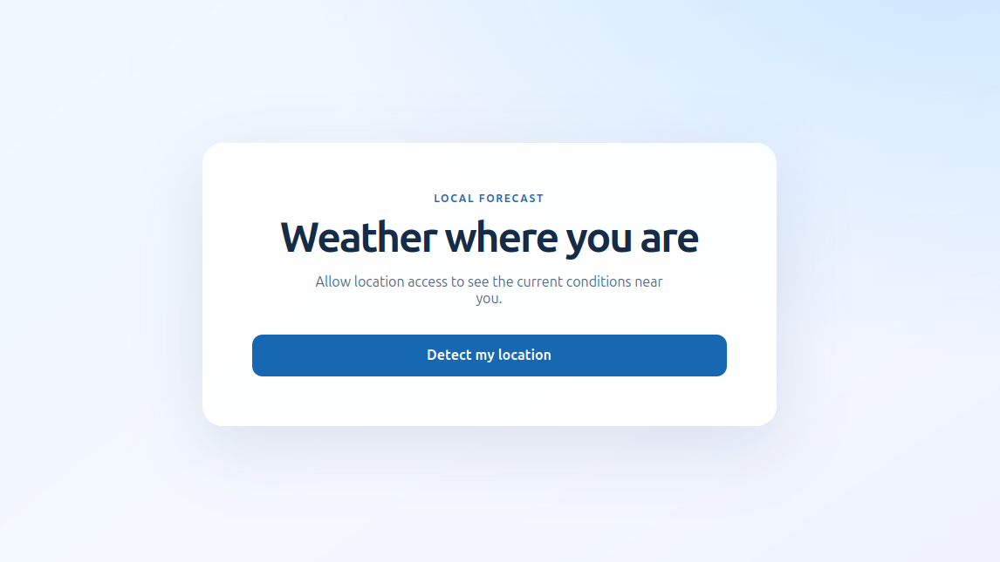
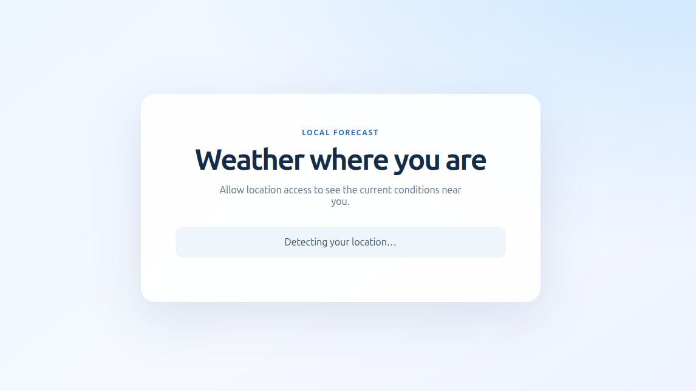
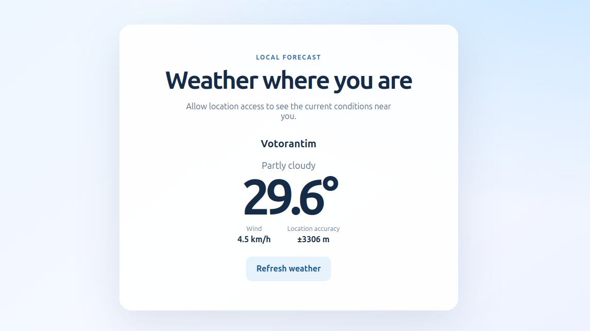

# Weather Forecast

Aplicação web que mostra o clima atual da localização do usuário. A pessoa escolhe quando compartilhar a localização; depois, o app busca a previsão e tenta identificar a cidade ou localidade.

## Como funciona

### 1. Tela inicial

Ao abrir a aplicação, nenhuma solicitação de localização é feita automaticamente. Clique em **Detect my location** para iniciar o fluxo e permitir que o navegador solicite acesso à localização.



### 2. Localização em andamento

Depois do clique, o navegador obtém as coordenadas. Enquanto a localização está sendo detectada, a aplicação informa que está trabalhando.



### 3. Previsão do tempo

Com as coordenadas disponíveis, o app consulta o Open-Meteo e exibe a temperatura, a condição atual e a velocidade do vento. Também mostra a localidade encontrada e a precisão da localização, quando disponíveis.



Se não for possível resolver o nome da localidade, a previsão continua visível e o app mostra as coordenadas. Erros de localização ou de consulta do clima são apresentados com uma opção para tentar novamente.

## Tecnologias e serviços

- **React 19**, **TypeScript 6** e **Vite 8**
- **Geolocation API** do navegador, acionada somente por uma ação explícita da pessoa
- **Open-Meteo** para obter a previsão atual, sem chave de API
- **BigDataCloud** para converter as coordenadas em um nome de localidade
- `fetch` nativo e CSS Modules, sem bibliotecas adicionais para chamadas HTTP ou estilos

As coordenadas são enviadas aos serviços de previsão e geocodificação para obter os dados exibidos. A aplicação não salva a localização em uma conta nem em armazenamento persistente.

## Executar localmente

Pré-requisitos: Node.js compatível com Vite 8 e npm.

```bash
npm install
npm run dev
```

Abra o endereço local mostrado pelo Vite no terminal.

## Scripts

| Comando | Descrição |
| --- | --- |
| `npm run dev` | Inicia o servidor de desenvolvimento |
| `npm run build` | Verifica os tipos TypeScript e gera o build de produção em `dist/` |
| `npm run preview` | Serve localmente o build de produção |
| `npm run lint` | Executa o ESLint, se estiver configurado no ambiente |

## Estrutura principal

```text
src/
├── App.tsx                       # Fluxo da interface e estados da previsão
├── App.module.css                # Estilos do cartão e dos estados
├── hooks/
│   └── useGeolocation.ts         # Solicitação e estado da localização
└── services/
    ├── geocodingClient.ts        # Reverse geocoding com BigDataCloud
    └── weatherClient.ts          # Previsão e códigos climáticos Open-Meteo
```
